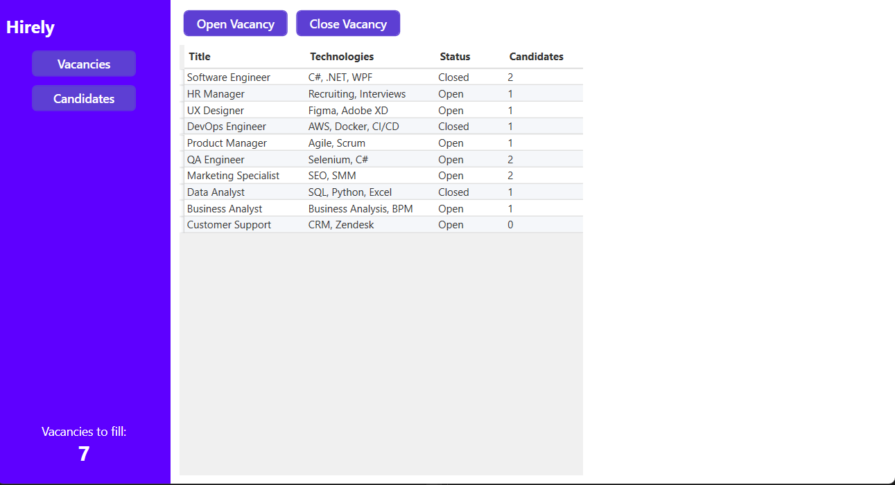
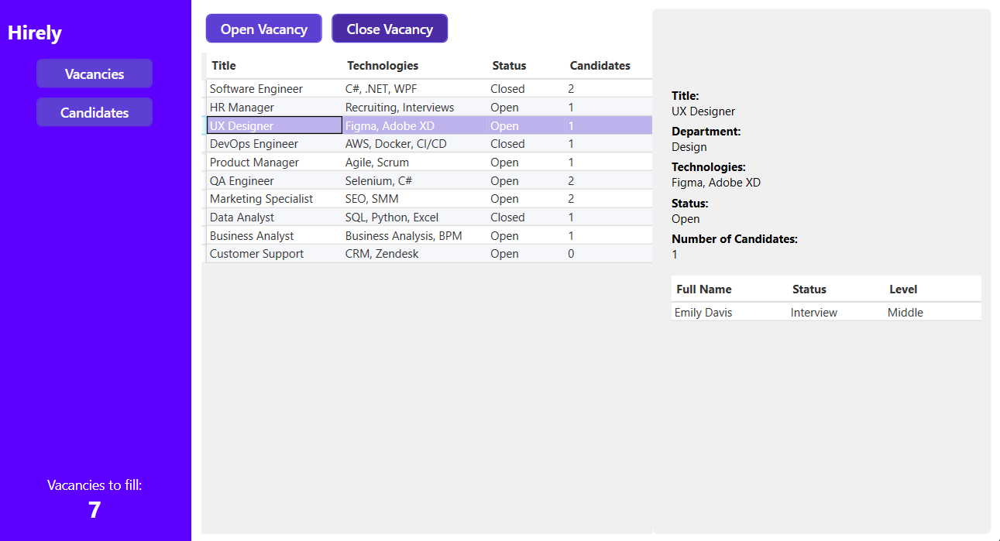
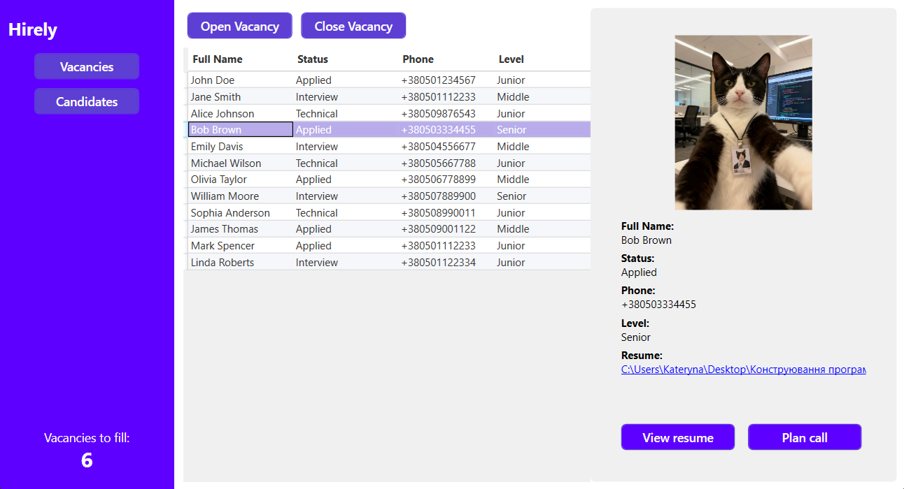
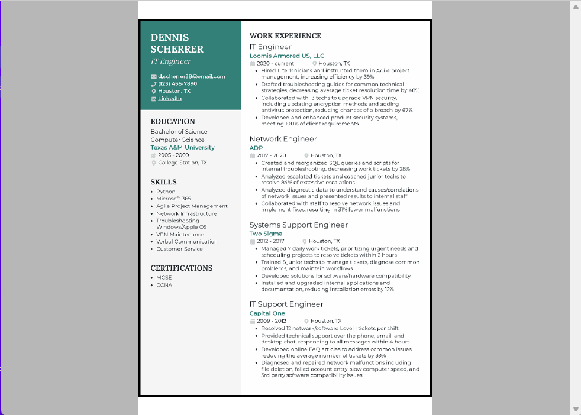

# Hirely

**Hirely** is a WPF university application designed to help HR managers efficiently manage vacancies and candidates.  

The project features two main pages:  

- **Vacancies List** – displays all open and closed vacancies with details and status. HR managers can open or close each vacancy.  
- **Candidates List** – shows candidates’ personal data, details, and resumes in PDF format, viewable directly within the application.  

The app also includes a **status indicator**, providing a quick overview of open positions and helping HR managers track what needs to be done.

---

## Technologies

- **WPF (Windows Presentation Foundation)**  
- **C# (.NET 8.0)**  
- **MVVM (Model-View-ViewModel)**  
- **JSON**  
- **Mapster**  

---

## Functionality

- View vacancies list with details and status  
- View candidates list with personal information  
- Review candidates' resumes directly in the app  
- Open or close vacancy status  
- See list of candidates for each vacancy  
- Track the number of open vacancies  

---

## Instruction

1. Install **Visual Studio 2022** or newer.  
2. Ensure **.NET 8 SDK** is installed.  
3. Clone the repository:  
   ```bash
   git clone <URL_of_this_repo>
   ```
4. Open the .sln file in Visual Studio.
5. Run the project.

---

## Screenshots / Demo

### Main page


### Vacancies list


### Candidates list


### Resume Viewer


> **Note:** All images are for demonstration purposes and are not owned by the project author.
